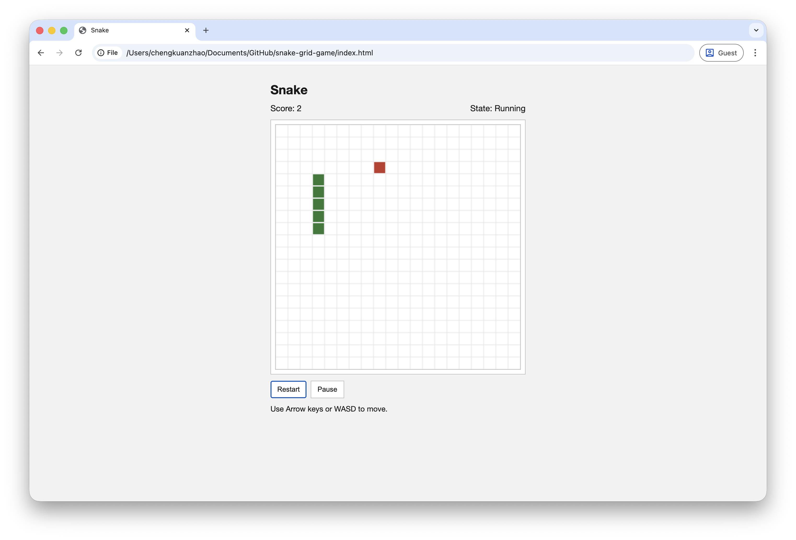

# Snake Grid Game

A minimal browser-based implementation of the classic Snake game.

## Live Demo

[Play on GitHub Pages](https://chengkuanzhao.github.io/snake-grid-game/)

## Screenshot



## Features

- Fixed grid movement loop
- Snake growth when food is eaten
- Random food spawn on free cells only
- Score tracking
- Game over on wall or self collision
- Restart and pause/resume

## Controls

- Keyboard: Arrow keys or `W A S D`
- Pause/Resume: `Space` or **Pause** button
- Restart: **Restart** button
- Mobile/small screens: on-screen direction buttons

## Run

Open `index.html` in any modern browser.

Optional local server (if needed for your browser settings):

```bash
npx serve .
```

## Files

- `index.html` - page structure
- `styles.css` - styling
- `snake.js` - game logic + rendering + input handling
- `snake-logic.js` - deterministic core logic module
- `snake-logic.test.js` - core logic tests

## Test (optional)

```bash
node --test snake-logic.test.js
```
